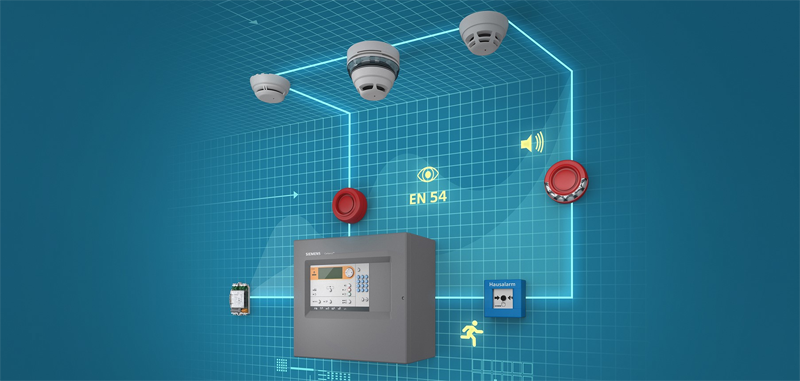
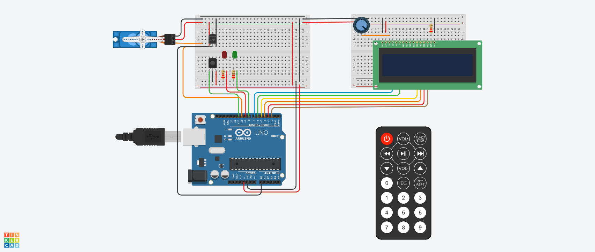

# Sistema de Incendios con Arduino.

## Desarrollado por: 
- Diego Uthurburu

## Proyecto: Sistema de Incendios con Arduino.

## Descripción
Sistema de incendio utilizando Arduino que pueda
detectar cambios de temperatura y activar un servo motor en caso de detectar un incendio.
Además, se mostrará la temperatura actual y la estación del año en un display LCD.

## Funciónes principales
Estas funciones se encargan de encender y apagar los leds, mostrar mensajes en el LCD, control de servomotor y funciones con control remoto.

  LED_RED, LED_GREEN, SERVO, IR(sensor inflarrojo)
 son #define que utilizamos para agregar los leds ,sensor y servomotor, asociandolo a pines de la placa arduino.

(Esta funcion se encarga de prender y apagar los Led )

~~~ C++ (lenguaje en el que esta escrito)
void controlar_leds(int led, int estado)
{
	digitalWrite(led, estado);

}
~~~
(Esta funcion se encarga de escribir en el LCD de 16x2)

~~~ C++ (lenguaje en el que esta escrito)
void mostrar_lcd(int cursor, char* texto, float tem)
{ 
	if (cursor == 1)
    {	
		lcd.setCursor(0,0);//se setea el cursor
		lcd.print(texto);//se escribe el mesaje
    }
  	else if (cursor == 2) 
  	{
		lcd.setCursor(0,1);
    	lcd.print(texto);
  	}
  	else
  	{
      	lcd.setCursor(0,1);
    	lcd.print(tem);
      	lcd.print("°C");
  	}
}
~~~

  (Esta funcion se encarga de manjar el cambio de estacion del sistema de incendios, prenderlo y apagarlo)
~~~ C++ (lenguaje en el que esta escrito)
bool manejar_sistema(long opcion, float* maxima)
{
	lcd.clear();
	switch(valor_recibido)
  {
    case boton_power:
      if (estado){
        mostrar_lcd(1, "Sistema");
        mostrar_lcd(2, "Encendido");
        controlar_leds(LED_GREEN,HIGH);
        controlar_leds(LED_RED,LOW);
      }
      else
      {
        mostrar_lcd(1, "Sistema");
        mostrar_lcd(2, "Apagado");
        controlar_leds(LED_GREEN,LOW);
        controlar_leds(LED_RED,HIGH);
      }
    estado = !estado; 
    delay(1000);  
    break;
    case boton_1:
    detectar_incendio(60, temperatura);
    strcpy(estacion, "Primavera");
    *maxima = 50;
    break;
    case boton_2:
    strcpy(estacion, "Otoño");
    *maxima = 45;
    break;
    case boton_3:
    strcpy(estacion, "Invierno");
    *maxima = 40;
    break;
    case boton_4:
    strcpy(estacion, "Verano"); 
    *maxima = 60;
    break;
    default:

    break;
	}

	return estado; 
}
~~~

 (Esta funcion detecta si la temperatura exede el limite establecido )
~~~ C++ (lenguaje en el que esta escrito)
void detectar_incendio(float maxima, float temperatura)
{
	if(temperatura >= maxima && digitalRead(LED_GREEN)== HIGH)
    {	
      	lcd.clear();
    	myServo.write(180);
      	mostrar_lcd(1, "Incendio");
        mostrar_lcd(2, "Detectado");
    }
  	else
    {
    	myServo.write(90);
    }

}
~~~

## :robot: Link del proyecto

- Diego Uthurburu [ver proyecto](https://www.tinkercad.com/things/dUAMHj36BN8-segundoparcial-uthurburu-diego-1b/editel?sharecode=T01nyrNV-1RsKVK0F_79X5pnzPjwDI30ipUuflP0Tqo)

## Diagrama Esquematico:
- [Ver Diagrama](Segundo_parcial/Img/Segundo_Parcial_Diagrama.pdf)
---
### Fuentes
- [Consejos para documentar](https://www.sohamkamani.com/how-to-write-good-documentation/#architecture-documentation).

- [Lenguaje Markdown](https://markdown.es/sintaxis-markdown/#linkauto).

- [Markdown Cheatsheet](https://github.com/adam-p/markdown-here/wiki/Markdown-Cheatsheet).

- [Tutorial](https://www.youtube.com/watch?v=oxaH9CFpeEE).

- [Emojis](https://gist.github.com/rxaviers/7360908).

---
